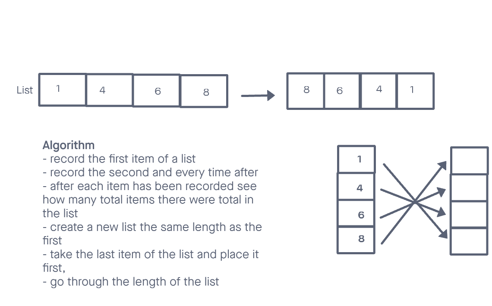

# Reverse an Array
Write a function wich takes in an array. Without using any built in methods return an array with elements in reversed order.
## Whiteboard Process

## Approach & Efficiency
i took a simple approach and tried to break it down as much as possible, step by step. instead of just saying repeat in reverse i took what step needs to be accomplished first.