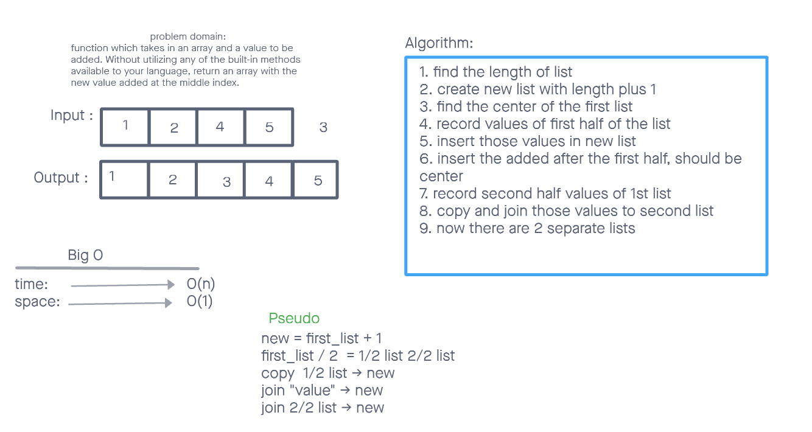

# Insert to Middle of an Array
<!-- Description of the challenge -->
Write a function which takes in an array and a value to be added. Without utilizing any of the built-in methods available to your language, return an array with the new value added at the middle index.

## Whiteboard Process
<!-- Embedded whiteboard image -->

## Approach & Efficiency
<!-- What approach did you take? Discuss Why. What is the Big O space/time for this approach? -->

i thought of plenty of ways to go about this. but the one that seemed most straightforward to me was to create a new list first with the length it should be. copy the first half of the first list and insert the new value. after it is insterted copy the second length of the list and join that to end of the new list and now the new list is created.