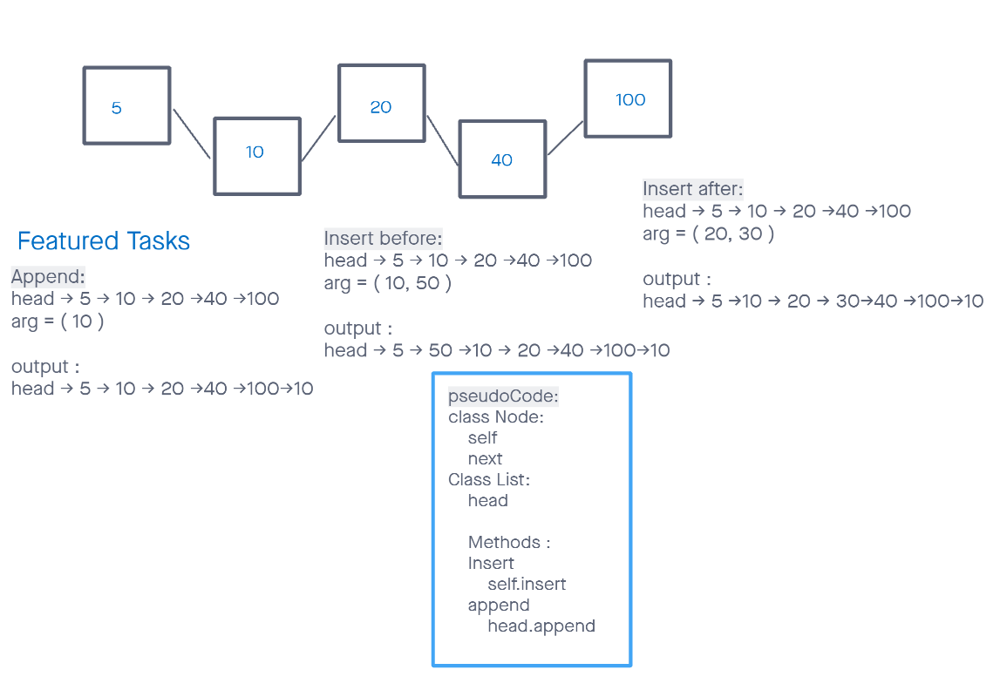

# Challenge Summary
<!-- Description of the challenge -->
Write methods for a Linked list.
These methods include, Append, Insert before and insert after. Test each method that it is working properly

## Whiteboard Process
<!-- Embedded whiteboard image -->


## Approach & Efficiency
<!-- What approach did you take? Why? What is the Big O space/time for this approach? -->
i started with insert, append and prepend since it seemed like the easiest to tackle since all you need to find is the beggining or end of the list and then after i implemented the insert before and afters. 
Time = O(n) everything gets searched right after another one by one. so it is searching in linear time
Space = O(1) it is the same linked list and no new node is being created so the amount of memory being used is constant

## Solution
<!-- Show how to run your code, and examples of it in action -->
Append - can be used to add to the end of the list <br>
insert_before is used to insert a Node before desired value selected <br>
insert_after is used to insert a node after desired value selected<br>
prepend - is used to insert at the head or very begining of linked list<br>

example:<br>

```python
    def append(self, value):
        new_node = Node(value)
        
        if self.head is None:
            self.head = new_node
            return
        
        current = self.head
        
        while current.next:
            current = current.next
        
        current.next = new_node
```